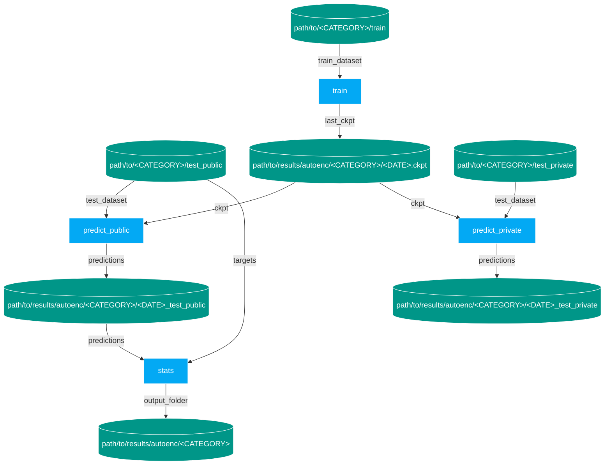

# The Eyecandies Dataset for Unsupervised Multimodal Anomaly Detection and Localization

This repository contains sample code to download and use the Eyecandies dataset in your project. Please refer to the [project page](https://eyecan-ai.github.io/eyecandies/) for more information about the publication. If you use this dataset in your research, please cite the following paper:

```
@inproceedings{bonfiglioli2022eyecandies,
    title={The Eyecandies Dataset for Unsupervised Multimodal Anomaly Detection and Localization},
    author={Bonfiglioli, Luca and Toschi, Marco and Silvestri, Davide and Fioraio, Nicola and De Gregorio, Daniele},
    booktitle={Proceedings of the 16th Asian Conference on Computer Vision (ACCV2022},
    note={ACCV},
    year={2022},
}
```

> **Warning**
>
> **This package is just an example on how to use the Eyecandies dataset and it is not meant to reproduce the results in the paper.**

## Get Started

Installing the package brings in everything you need to download and use the Eyecandies dataset.
However, it is better to first create a virtual environment and install `pytorch` following the instructions on the [official website](https://pytorch.org/get-started/locally/). For instance, to get `pytorch` 1.12.1 with `pip` and `venv` on Linux:

```bash
$ python3 -m venv <venv_path>
$ source <venv_path>/bin/activate
$ pip install torch==1.12.1 torchvision --extra-index-url https://download.pytorch.org/whl/cu116
```

Now you can get Eyecandies either directly from github:

```bash
$ pip install git+https://github.com/eyecan-ai/eyecandies.git
```

or by cloning the repository and installing it locally:

```bash
$ git clone https://github.com/eyecan-ai/eyecandies.git
$ pip install -e eyecandies
```

This package is built on top of [Pipelime](https://github.com/eyecan-ai/pipelime-python/).
You can find more information about Pipelime and its features in the [documentation](https://pipelime-python.readthedocs.io).
For example, you can list the available *pipelime* commands in this package with:

```bash
$ eyec list
```

Then, to see the help for a specific command, e.g. `ec-get`:

```bash
$ eyec help ec-get
```

## Download The Dataset

First, you should download the dataset. You can either get them one by one:

```bash
$ eyec ec-get +o <output_root_folder> +c <category_name>
```

or download all the categories at once:

```bash
$ eyec ec-get +o <output_root_folder>
```

Already downloaded categories will be skipped, of course. Here a list of the available categories:
- Candy Cane
- Chocolate Cookie
- Chocolate Praline
- Confetto
- Gummy Bear
- Hazelnut Truffle
- Licorice Sandwich
- Lollipop
- Marshmallow
- Peppermint Candy

## Train A Model

We provide a naive auto-encoder implementation to train a model on the Eyecandies dataset within the Pipelime framework.

> **Warning**
>
> **This naive auto-encoder is not the one deployed in the paper and it is not meant to be used in practice!**

Just create your own `tps_context.yaml` by copying `dags/tps_ctx_template.yaml` and filling the missing variables, namely:
- `data.root`: the root folder of the Eyecandies dataset
- `data.name`: the name of the category
- `result_folder`: the output folder

Then, run the full pipeline with:

```bash
$ eyec run --config dags/train_predict_stats.yaml --context dags/context.yaml
```

To understand what's going on, the pipeline can be drawn (you need `Graphviz` installed, see [Pipelime documentation](https://pipelime-python.readthedocs.io/en/latest/get_started/installation.html) for more info):

```bash
$ eyec draw --config dags/train_predict_stats.yaml --context dags/context.yaml
```



As you can see, the pipeline is composed of three main steps:
1. **autoenc-train**: the autoencoder is trained and a checkpoint is produced
2. **autoenc-predict**: the trained model predicts anomaly heatmaps on the public and private test set
3. **ec-metrics**: ROC and AUROC are computed on the predictions using the public ground truth

To get the results on any other method, just replace the first two nodes, then run **ec-metrics** on the new predictions. Note that results are given for the public test set only: to get the results on the private test set as well, please follow the instructions on the [Eyecandies website](https://eyecan-ai.github.io/eyecandies/).

## Metric Depths And Pointclouds

If you want to work with depth maps, you may want to convert them in meters.
To do so, we provide a stage that can be run as:

```bash
$ eyec -m eyecandies.stages map +s depth2mt +i path/to/eyecandies/dataset +o path/to/output/dataset
```

The output dataset has, for each sample, a `depth.npy` item, which is a float32 depth map in meters.
Note that all other files are **hard-linked**, so no extra space is used.

If you use the `depth2mt` stage in a python script, you should use its class name:

```python
from pipelime.sequences import SamplesSequence
from eyecandies.stages import DepthToMetersStage

seq = SamplesSequence.from_underfolder("path/to/eyecandies/dataset")
seq = seq.map(DepthToMetersStage())
```

To project depth points to a pointcloud, we provide the stage `depth2pc` too.
To run both stages in a row, you can use the `compose` builtin stage:

```bash
$ eyec map +i path/to/eyecandies/dataset +o path/to/output/dataset +stage.compose.stages[0] depth2mt +stage.compose.stages[1] depth2pc +g 4,10
```

where `+g 4,10` means that 4 processes will be spawned with a prefetch of 10 samples each.
The default behavior is to save a PLY file with points, normals and colors.

## Train And Testing With Anomalib

[Anomalib](https://github.com/openvinotoolkit/anomalib) is a popular framework to benchmark anomaly detection algorithms. To train and test on Eyecandies, you should first rearrange your data. We provide a ready-to-use Pipelime dag to extract and split the files, you just have to create your own `to_anomalib_context.yaml` by copying `dags/to_anomalib_ctx_template.yaml` and filling the missing variables, namely:
- `categories`: the list of categories to convert
- `eyecandies_root`: the path to the Eyecandies dataset root folder
- `output_root`: the path to the output dataset root folder
- `image_key`: the key of the image item to use for anomalib, e.g., image_5

Then run:

```bash
$ pipelime run --config dags/to_anomalib.yaml --context dags/to_anomalib_context.yaml
```

Pipelime can also create for you the `dataset` section of the configuration file required by Anomalib. Just run:

```bash
$ pipelime audit --config dags/anomalib_conf_template.yaml --context dags/to_anomalib_context.yaml -o dags/anomalib_conf.yaml
```

The output file `dags/anomalib_conf.yaml` contains a `dataset` section for each category you can copy-and-paste to your Anomalib configuration file.

To further customize the output, you can also set some other variables in the context:

```yaml
anomalib:
  image_size: 256
  train_batch_size: 64
  test_batch_size: 64
  num_workers: 4
  train_transform_config: null
```

or on the command line:

```bash
$ [...] @anomalib.image_size 256 @anomalib.train_batch_size 64 @anomalib.test_batch_size 64 @anomalib.num_workers 4 @anomalib.train_transform_config null
```
